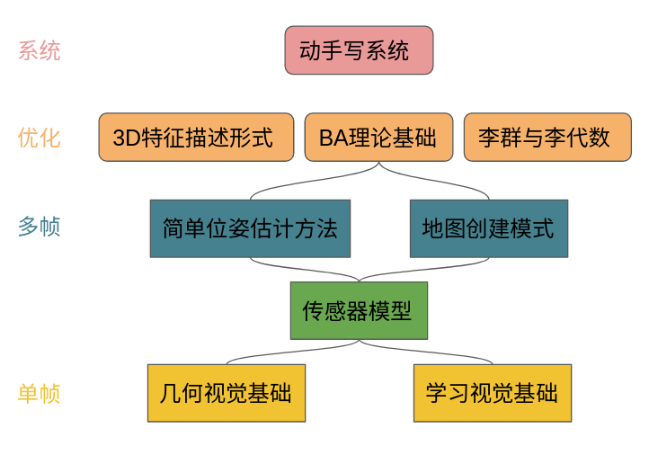
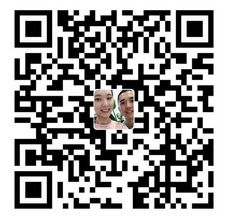

# SLAM 中的几何与学习方法 

近年来，深度学习在更高层级的视觉任务中取得瞩目的成绩，如:物体识别,语义分割等。这些课题曾是传统视觉无法或很难解决的任务。深度学习方法的这种能力拓展了我们对视觉任务的想象空间，越来越多的 SLAM 开始在他们的框架中通过融合学习的方法来改进位姿估计的准确程度和环境重建的效果。但是深度学习是一个非常宽广的领域,和 SLAM 相关的课题只是它的一个分支，本书稿将会挑选、聚焦与 SLAM 相关的深度学习任务，希望能通过这本书稿来介绍SLAM 系统中使用的几何和深度学习的方法，帮助读者掌握最新的进展。

## 更新说明

目标是每周更新一次，2020年12月完成书稿第一轮的写作。当前更新会陆续将我关注/参与的最新文章写到书中，目录中的章节也会随着内容的完善而不断调整，后面每章内容对应的代码也会整理到这个repo中。

| 章节 | 更新内容                          | 日期 | 备注 |
| ---- | --------------------------------- | :--: | ---: |
| 5    | tracking中对极几何与PnP           | 5.01 |      |
| 7    | bundle adjustment, 目标方程与解算 | 5.04 |      |
| 3.3  | normal prediction                 | 5.07 |      |
| 2.2  | 几何特征提取                      | 5.11 |      |

## 改善书稿质量

如果你在阅读材料的过程中发现问题，请在这里提交一个issue，我可以继续修改它。

如果你有问题/建议，请给我发邮件：yanyan.li@pku.edu.cn, 主题带有 “GL-SLAM书稿”。

## 捐助

如果你想通过微信小额捐助来支持书稿的创作，我将十分感谢。

## 版权声明

本项目遵循 “署名-非商业性使用-相同方式共享 4.0 国际 (CC BY-NC-SA 4.0)” 协议。这是一份普通人可以理解的[许可协议](https://creativecommons.org/licenses/by-nc-sa/4.0/legalcode.zh-Hans)概要 (但不是替代) 。 [免责声明](https://creativecommons.org/licenses/by-nc-sa/4.0/deed.zh#).

您可以自由地：

- **共享** — 在任何媒介以任何形式复制、发行本作品
- **演绎** — 修改、转换或以本作品为基础进行创作

只要你遵守许可协议条款，许可人就无法收回你的这些权利。 惟须遵守下列条件：

- **署名** — 您必须给出[适当的署名](https://creativecommons.org/licenses/by-nc-sa/4.0/deed.zh#)，提供指向本许可协议的链接，同时[标明是否（对原始作品）作了修改](https://creativecommons.org/licenses/by-nc-sa/4.0/deed.zh#)。您可以用任何合理的方式来署名，但是不得以任何方式暗示许可人为您或您的使用背书。
- **非商业性使用** — 您不得将本作品用于[商业目的](https://creativecommons.org/licenses/by-nc-sa/4.0/deed.zh#)。
- **相同方式共享** — 如果您再混合、转换或者基于本作品进行创作，您必须基于[与原先许可协议相同的许可协议](https://creativecommons.org/licenses/by-nc-sa/4.0/deed.zh#) 分发您贡献的作品。
- **没有附加限制** — 您不得适用法律术语或者 [技术措施](https://creativecommons.org/licenses/by-nc-sa/4.0/deed.zh#) 从而限制其他人做许可协议允许的事情。

